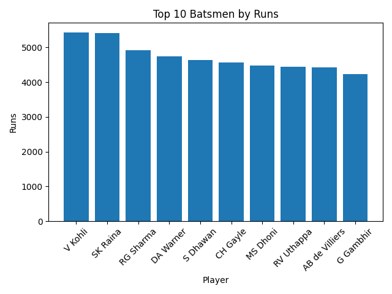
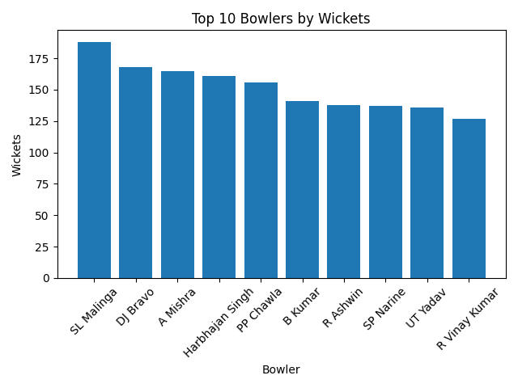
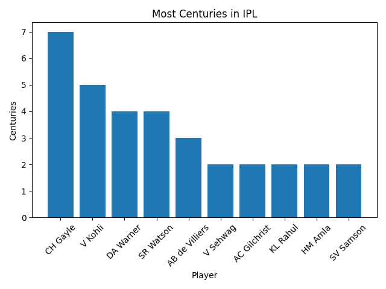

# 🏏 IPL Data Engineering Project

This project performs a comprehensive data analysis of the Indian Premier League (IPL) using **PySpark on Databricks**. It focuses on large-scale data processing and extracting meaningful insights about player and team performance.

---

## 📁 Dataset

* `matches.csv`: Match-level data (match ID, season, teams, winner, player of match, etc.)
* `deliveries.csv`: Ball-by-ball data (batsman, bowler, runs, dismissals, extras, etc.)

**Dataset Source:** Kaggle IPL Dataset

---

## 🛠️ Tools Used

* Python 🐍
* PySpark ⚡
* Databricks ☁️
* SQL

---

## 🎯 Project Objectives

* Identify top-performing batsmen and bowlers
* Calculate strike rate for player performance
* Analyze players with most centuries in IPL history
* Determine best player from each team
* Analyze team performance and match outcomes

---

## 📊 Key Insights

* Top batsmen identified based on total runs scored
* Strike rate calculated using ball-by-ball data
* Players with highest number of centuries derived
* Best player from each team identified using Player of Match awards
* Team-wise match wins and performance trends analyzed

---

## ⚙️ Data Processing Steps

* Data cleaning (handling null values and duplicates)
* Joining match-level and delivery-level datasets
* Aggregation using PySpark (`groupBy`, `agg`)
* Window functions for ranking players
* Writing output in distributed format

---

## 📁 Project Structure

```
IPL_DATA_ENGINEERING_PROJECT/
│
├── data/
│   ├── matches.csv
│   └── deliveries.csv
│
├── scripts/
│   ├── ipl_analysis.py
│   └── visualization.py
│
├── output/
│   └── (generated after running script)
│
├── images/
│   └── (graphs generated after visualization)
│
└── README.md
```

---

## ▶️ How to Run This Project

1. Clone this repository
2. Place `matches.csv` and `deliveries.csv` inside the `data/` folder
3. Ensure PySpark is installed and configured
4. Run the analysis script:

```
python scripts/ipl_analysis.py
```

5. Run visualization script:

```
python scripts/visualization.py
```

6. Output files will be generated inside the `output/` folder
7. Graphs will be saved inside the `images/` folder

---

## 📊 Visualizations

### 🏏 Top Batsmen



### 🎯 Top Bowlers



### 💯 Most Centuries



---

## ⚠️ Note

* This project uses PySpark, so a Spark environment is required
* Output files are not included and will be generated after execution

---

## 👨‍💻 Author

Tahseen Nadaf
Aspiring Data Engineer | Python | PySpark | SQL | Databricks
